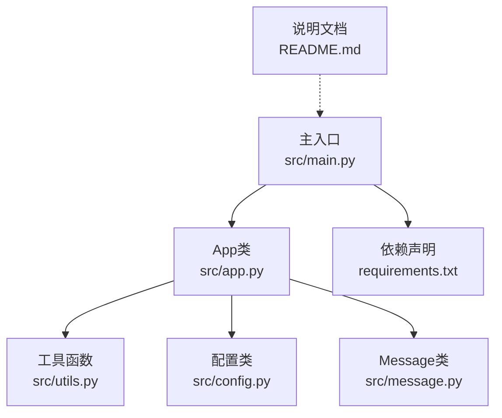
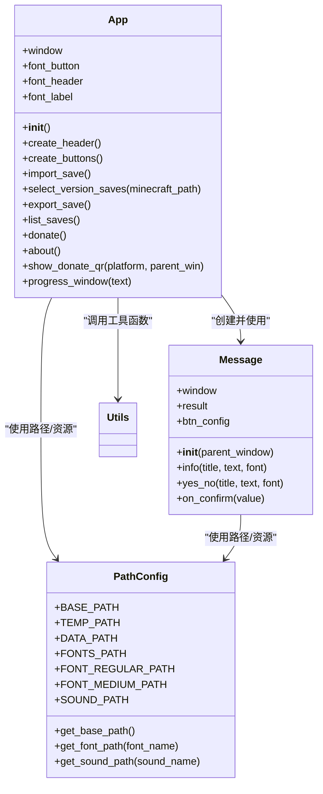
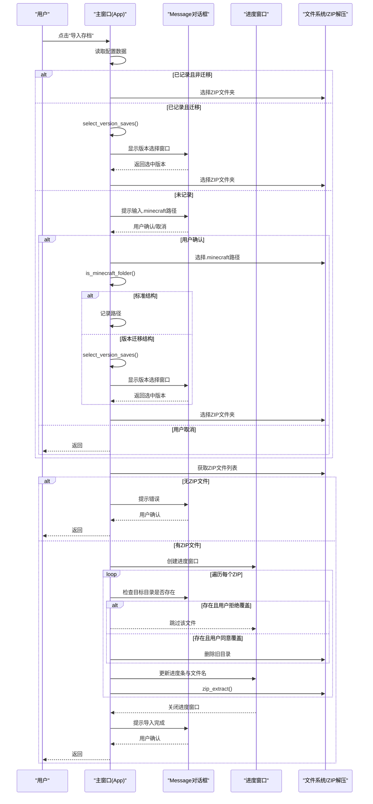
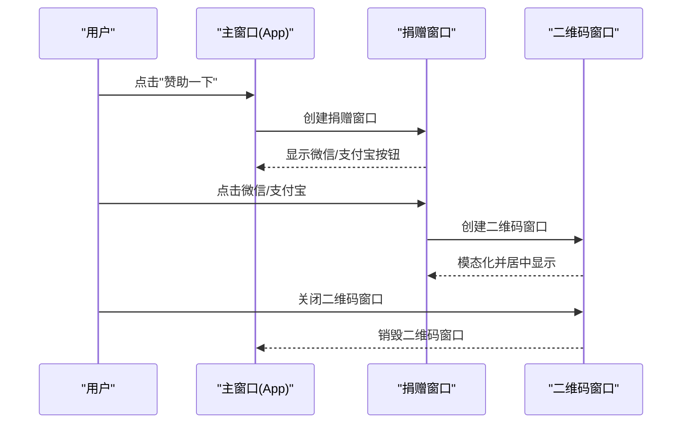
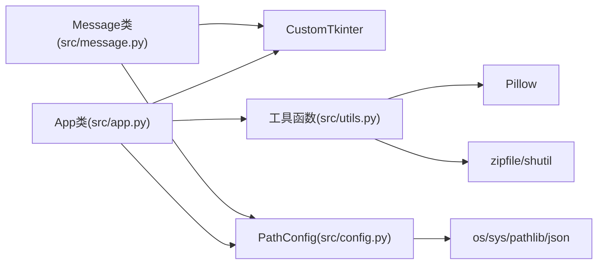

# GUI界面系统

<cite>
**本文引用的文件**
- [src/app.py](file://src/app.py)
- [src/message.py](file://src/message.py)
- [src/main.py](file://src/main.py)
- [src/config.py](file://src/config.py)
- [src/utils.py](file://src/utils.py)
- [README.md](file://README.md)
- [requirements.txt](file://requirements.txt)
</cite>

## 更新摘要
**变更内容**
- GUI系统已重构为基于App类的新架构，src/gui.py重命名为src/app.py
- 新增Message类用于模态对话框处理，提供统一的消息提示和确认机制
- 四个核心功能按钮的实现更加完善，包含导入存档、导出存档、存档列表、赞助一下等功能
- 引入了更完善的组件组织和功能模块，提升了代码的可维护性和扩展性

## 目录
1. [简介](#简介)
2. [项目结构](#项目结构)
3. [核心组件](#核心组件)
4. [架构总览](#架构总览)
5. [详细组件分析](#详细组件分析)
6. [依赖关系分析](#依赖关系分析)
7. [性能考量](#性能考量)
8. [故障排查指南](#故障排查指南)
9. [结论](#结论)
10. [附录](#附录)

## 简介
本文件面向存档管理器的GUI界面系统，重点围绕重构后的App类架构设计与实现细节展开，涵盖主窗口布局、四个核心功能按钮的实现逻辑、进度条与消息对话框系统、CustomTkinter框架的使用方式、现代化主题设计与响应式布局原理，并提供可直接定位到源码的路径示例，帮助开发者快速理解与扩展界面系统。

## 项目结构
项目采用"模块化分层"的组织方式：
- 主入口负责实例化App并启动事件循环
- App类封装主窗口、头部标题区、功能按钮区、以及各类交互流程
- Message类专门处理模态对话框，提供统一的信息提示和确认机制
- 工具模块提供通用能力：ZIP解压、图像加载、文件夹选择、数据读写、窗口居中与自动宽度适配等
- 配置模块统一管理路径、字体与音效资源，兼容开发与打包两种运行环境



**图表来源**
- [src/main.py:1-7](file://src/main.py#L1-L7)
- [src/app.py:1-631](file://src/app.py#L1-L631)
- [src/message.py:1-114](file://src/message.py#L1-L114)
- [src/utils.py:1-186](file://src/utils.py#L1-L186)
- [src/config.py:1-94](file://src/config.py#L1-L94)
- [requirements.txt:1-10](file://requirements.txt#L1-L10)

**章节来源**
- [src/main.py:1-7](file://src/main.py#L1-L7)
- [README.md:1-94](file://README.md#L1-L94)

## 核心组件
- App类：主窗口控制器，负责窗口初始化、标题与按钮区域创建、四大功能按钮的事件绑定与业务流程调度、进度条与消息对话框的创建与管理。
- Message类：专门的模态消息对话框封装，提供信息提示与"是/否"确认两种常用交互，支持音效反馈和自动窗口尺寸调整。
- PathConfig类：路径与资源管理，统一字体、音效、图片资源的加载路径，兼容打包环境。
- 工具函数：zip_extract、get_image、folder_dialog、write_data、read_data、center_window、auto_label_window_width、is_minecraft_folder等。

**章节来源**
- [src/app.py:5-631](file://src/app.py#L5-L631)
- [src/message.py:4-114](file://src/message.py#L4-L114)
- [src/config.py:15-94](file://src/config.py#L15-L94)
- [src/utils.py:1-186](file://src/utils.py#L1-L186)

## 架构总览
App类通过CustomTkinter构建主窗口，采用两行三列的按钮网格布局，辅以标题区与图标。四个核心功能按钮分别绑定导入存档、导出存档、存档列表、赞助一下等操作；其中"导入存档"流程最为复杂，涉及Minecraft路径检测、版本迁移选择、ZIP批量解压、进度反馈与覆盖确认等步骤；"赞助一下"提供二维码展示窗口；其他功能按钮当前处于占位状态，提示"功能开发中"。



**图表来源**
- [src/app.py:5-631](file://src/app.py#L5-L631)
- [src/message.py:4-114](file://src/message.py#L4-L114)
- [src/config.py:15-94](file://src/config.py#L15-L94)
- [src/utils.py:1-186](file://src/utils.py#L1-L186)

## 详细组件分析

### App类：主窗口与布局
- 窗口初始化：设置固定尺寸、标题、背景色、外观模式为浅色；加载字体文件；创建标题区与按钮区。
- 标题区：包含应用图标与主标题，使用Medium字体与深色文本。
- 按钮区：两行三列布局，每行独立容器，按钮具有统一尺寸、圆角边框、悬停颜色与复合布局（图标在上、文字在下）。
- 四个核心按钮：
  - 导入存档：触发导入流程，包含Minecraft路径检查、版本迁移选择、ZIP批量解压、进度反馈与覆盖确认。
  - 导出存档：当前占位，提示"功能开发中"。
  - 存档列表：当前占位，提示"功能开发中"。
  - 赞助一下：打开捐赠窗口，提供微信/支付宝按钮，点击后弹出对应二维码窗口。
  - 关于软件：当前占位，预留扩展空间。
- 进度条窗口：创建模态进度窗口，包含进度条、百分比与文件名标签，逐个处理ZIP时更新状态。
- 消息对话框：通过Message类提供信息提示与"是/否"确认，均以模态方式阻塞等待用户操作。

**章节来源**
- [src/app.py:6-36](file://src/app.py#L6-L36)
- [src/app.py:37-166](file://src/app.py#L37-L166)
- [src/app.py:167-302](file://src/app.py#L167-L302)
- [src/app.py:303-412](file://src/app.py#L303-L412)
- [src/app.py:413-517](file://src/app.py#L413-L517)
- [src/app.py:549-596](file://src/app.py#L549-L596)

### 导入存档流程（序列图）
该流程展示了从用户点击按钮到完成导入的完整调用链，包括路径检测、版本选择、ZIP批量解压、进度更新与覆盖确认。



**图表来源**
- [src/app.py:167-302](file://src/app.py#L167-L302)
- [src/app.py:303-412](file://src/app.py#L303-L412)
- [src/message.py:29-65](file://src/message.py#L29-L65)
- [src/utils.py:4-32](file://src/utils.py#L4-L32)

**章节来源**
- [src/app.py:167-302](file://src/app.py#L167-L302)
- [src/app.py:303-412](file://src/app.py#L303-L412)
- [src/message.py:29-65](file://src/message.py#L29-L65)
- [src/utils.py:4-32](file://src/utils.py#L4-L32)

### 赞助一下与二维码展示（序列图）
展示"赞助一下"按钮的点击流程与二维码窗口的模态化处理。



**图表来源**
- [src/app.py:413-517](file://src/app.py#L413-L517)
- [src/app.py:518-548](file://src/app.py#L518-L548)

**章节来源**
- [src/app.py:413-517](file://src/app.py#L413-L517)
- [src/app.py:518-548](file://src/app.py#L518-L548)

### 模态消息对话框（流程图）
Message类提供信息提示与"是/否"确认两种交互，均采用模态窗口阻塞主线程，直到用户操作完成。

```mermaid
flowchart TD
Start(["进入对话框"]) --> Type{"对话框类型"}
Type --> |信息提示| Info["显示提示文本<br/>显示"确定"按钮"]
Type --> |选择确认| YesNo["显示问题文本<br/>显示"好的/不要"按钮"]
Info --> AutoSize["自动调整窗口宽度<br/>居中显示"]
YesNo --> AutoSize
AutoSize --> Modal["设置模态并等待"]
Modal --> Action{"用户操作"}
Action --> |确定/好的| Confirm["设置结果为True<br/>销毁窗口"]
Action --> |取消/不要| Cancel["设置结果为False<br/>销毁窗口"]
Confirm --> End(["返回结果"])
Cancel --> End
```

**图表来源**
- [src/message.py:29-114](file://src/message.py#L29-L114)

**章节来源**
- [src/message.py:29-114](file://src/message.py#L29-L114)

### 响应式布局与主题设计
- 响应式布局：按钮容器使用两行三列布局，行内使用填充与对齐控制，确保在固定窗口尺寸下保持视觉平衡。
- 主题设计：浅色外观模式、统一圆角半径与边框宽度、不同功能按钮采用差异化色彩方案，提升可识别性与一致性。
- 字体体系：标题使用Medium字体，按钮与标签使用Regular字体，字号分级明确，满足可读性与层次感。
- 图标与图像：通过统一的图像加载函数支持缩放，保证在不同DPI与窗口尺寸下的清晰度。

**章节来源**
- [src/app.py:14-30](file://src/app.py#L14-L30)
- [src/app.py:59-166](file://src/app.py#L59-L166)
- [src/utils.py:34-65](file://src/utils.py#L34-L65)

### 事件处理机制与扩展点
- 事件绑定：按钮的command参数直接绑定到App类的方法，形成清晰的职责划分。
- 模态窗口：通过grab_set与wait_window实现阻塞式交互，确保流程顺序与用户确认。
- 扩展建议：
  - 将按钮配置参数抽取为常量或配置表，便于统一维护与主题切换。
  - 将"功能开发中"的按钮替换为实际实现或占位页面，保持界面一致性。
  - 在导入流程中加入异常捕获与日志输出，提升稳定性与可观测性。

**章节来源**
- [src/app.py:90-166](file://src/app.py#L90-L166)
- [src/message.py:29-114](file://src/message.py#L29-L114)

## 依赖关系分析
- App依赖CustomTkinter进行UI构建，依赖配置模块的路径与资源，依赖工具模块的通用能力。
- Message类依赖CustomTkinter创建模态窗口，依赖配置模块的音效路径。
- 工具模块依赖Pillow进行图像处理，依赖zipfile与shutil进行ZIP解压与目录操作。
- 配置模块统一管理路径，兼容开发与打包两种运行环境。



**图表来源**
- [src/app.py:1-631](file://src/app.py#L1-L631)
- [src/message.py:1-114](file://src/message.py#L1-L114)
- [src/config.py:1-94](file://src/config.py#L1-L94)
- [src/utils.py:1-186](file://src/utils.py#L1-L186)
- [requirements.txt:1-10](file://requirements.txt#L1-L10)

**章节来源**
- [src/app.py:1-631](file://src/app.py#L1-L631)
- [src/message.py:1-114](file://src/message.py#L1-L114)
- [src/config.py:1-94](file://src/config.py#L1-L94)
- [src/utils.py:1-186](file://src/utils.py#L1-L186)
- [requirements.txt:1-10](file://requirements.txt#L1-L10)

## 性能考量
- ZIP解压流程：先解压至临时目录再移动到目标路径，避免直接写入目标导致的权限与并发问题；批量处理时逐个更新进度，避免界面卡顿。
- 界面刷新：进度窗口在每次迭代后调用更新，确保UI及时反映处理进度。
- 资源加载：字体与图像在初始化阶段集中加载，减少后续渲染开销。
- 模态窗口：通过wait_window阻塞主线程，避免并发状态冲突，但需注意长时间阻塞可能影响用户体验，建议在长任务中考虑后台线程与异步更新。

**章节来源**
- [src/app.py:263-302](file://src/app.py#L263-L302)
- [src/app.py:549-596](file://src/app.py#L549-L596)
- [src/utils.py:4-32](file://src/utils.py#L4-L32)

## 故障排查指南
- 路径与打包问题
  - 若在打包后无法找到字体/图片/音效，请确认打包命令中已添加相应资源路径。
  - 检查配置模块的路径解析逻辑，确保在冻结环境下正确指向临时资源目录。
- ZIP解压失败
  - 确认ZIP文件非空且包含有效内容；若解压后临时目录无内容，将抛出异常。
  - 检查目标目录权限与磁盘空间。
- 界面卡顿
  - 在大量文件处理时，适当降低更新频率或使用后台线程处理，避免阻塞主线程。
- 模态窗口无法聚焦
  - 确保在窗口创建后延迟设置grab_set，避免grab失败。
- 蒙版与层级
  - 使用transient(parent)使子窗口置顶于父窗口，避免层级混乱。

**章节来源**
- [src/config.py:18-22](file://src/config.py#L18-L22)
- [src/config.py:78-91](file://src/config.py#L78-L91)
- [src/utils.py:161-186](file://src/utils.py#L161-L186)
- [src/app.py:549-596](file://src/app.py#L549-L596)

## 结论
App类以清晰的职责划分与模块化设计实现了简洁而实用的GUI界面，结合CustomTkinter的现代化主题与响应式布局，提供了良好的用户体验。导入存档流程体现了完整的路径检测、版本迁移、批量处理与进度反馈机制；Message类与进度窗口共同构成了可靠的用户交互闭环。新架构通过专门的消息对话框类实现了更好的代码分离和可维护性，为未来的功能扩展奠定了坚实基础。

## 附录
- 快速开始
  - 运行：python src/main.py
  - 依赖安装：pip install -r requirements.txt
- 打包参考
  - 使用PyInstaller打包时，确保将img与fonts目录作为资源一并打包。

**章节来源**
- [README.md:42-86](file://README.md#L42-L86)
- [requirements.txt:1-10](file://requirements.txt#L1-L10)