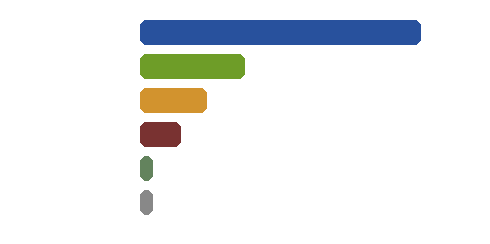

# 🗃️ 存档管理器

一个简单好用的 Minecraft Java版 存档管理工具。


## ✨ 功能特点

- 📥 **导入存档**：一键将下载的 ZIP 地图解压到 `.minecraft/saves` 文件夹
- 📤 **导出备份**：将现有存档打包备份
- 📋 **查看列表**：管理你的所有存档
- ❤️ **赞助一下**：支持开发者

## 配色方案


## �️ 技术栈


## 📊 项目统计

| 统计项 | 数量 |
|--------|------|
| Python 文件 | 6 个 |
| 总代码行数 | 1,543 行 |
| 函数数量 | 10 个 |
| 类数量 | 3 个 |
| 图片资源 | 14 个 |
| 字体文件 | 2 个 |

### 代码分布


## � 下载

前往 [Releases](https://github.com/TuxLin123233/Minecraft-Save-Manager/releases) 页面下载最新版本。

## 🚀 使用方法

1. 打开程序
2. 点击对应功能按钮
3. 选择文件夹
4. 等待完成

## 📁 项目结构

```
存档管理器/
├── src/            # 源代码
├── img/            # 图片资源（截图、配色方案等）
├── icon/           # 图标文件（按钮图标等）
├── fonts/          # 字体文件
├── sounds/         # 音效文件
├── wiki/           # 项目文档
├── data.json       # 配置文件
└── README.md       # 说明文档
```

## 🛠️ 开发环境

- Python 3.10+
- CustomTkinter
- Pillow

## 📦 自行打包

### 基础打包

```bash
# 安装依赖
pip install -r requirements.txt

# 打包
cd src
pyinstaller -F --noconsole --icon="../icon.ico" --name="存档管理器" --add-data="../img;img" --add-data="../icon;icon" --add-data="../fonts;fonts" --add-data="../sounds;sounds" main.py
```

### 使用 UPX 压缩（可选）

UPX 是一个可执行文件压缩工具，可以显著减小 exe 文件的大小（通常可减少 50-70%）。

#### Windows

```bash
# 1. 下载 UPX
# 访问 https://github.com/upx/upx/releases 下载 Windows 版本
# 解压后获得 upx.exe

# 2. 使用 UPX 打包
cd src
pyinstaller -F --noconsole --icon="../icon.ico" --name="存档管理器" --add-data="../img;img" --add-data="../icon;icon" --add-data="../fonts;fonts" --add-data="../sounds;sounds" --upx-dir="../upx-路径" main.py
```

#### Linux/macOS

```bash
# 安装 UPX
# Ubuntu/Debian: sudo apt-get install upx
# macOS: brew install upx

# 使用 UPX 打包
cd src
pyinstaller -F --noconsole --icon="../icon.ico" --name="存档管理器" --add-data="../img;img" --add-data="../icon;icon" --add-data="../fonts;fonts" --add-data="../sounds;sounds" main.py
```

**注意事项**：
- UPX 压缩会增加约 10-20% 的启动时间
- 某些杀毒软件可能会误报压缩后的 exe
- 如果压缩失败，可以去掉 `--upx-dir` 参数使用基础打包

## 🙏 致谢

本项目图标来源于 [Yesicon](https://yesicon.app/)，遵循各图库开源许可证，特此致谢。

## 📄 许可证

MIT License © 2026 TuxLin123233