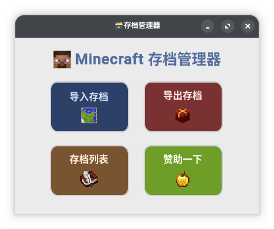

# 🗃️ 存档管理器

一个简单好用的 Minecraft Java版 存档管理工具。



## ✨ 功能特点

- 📥 **导入存档**：一键将下载的 ZIP 地图解压到 `.minecraft/saves` 文件夹
- 📤 **导出备份**：将现有存档打包备份
- 📋 **查看列表**：管理你的所有存档
- ❤️ **赞助一下**：支持开发者

## 📥 下载

前往 [Releases](https://github.com/TuxLin123233/Minecraft-Save-Manager/releases) 页面下载最新版本。

## 🚀 使用方法

1. 打开程序
2. 点击对应功能按钮
3. 选择文件夹
4. 等待完成

## 📁 项目结构

```
存档管理器/
├── code/           # 源代码
├── img/            # 图片资源
├── icons/          # 图标文件
├── data.json       # 配置文件
└── README.md       # 说明文档
```

## 🛠️ 开发环境

- Python 3.10+
- CustomTkinter
- Pillow

## 📦 自行打包

```bash
# 安装依赖
pip install -r requirements.txt

# 打包
cd code
pyinstaller -F --icon="../icon.ico" --name="存档管理器" main.py
```

## 📄 许可证

MIT License © 2026 TuxLin123233